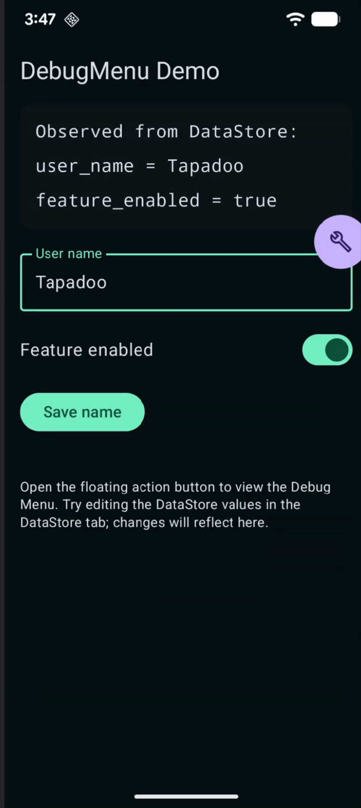

## Tapadoo Android Debug Menu
A simple library to add a debug menu to your Android app for quick access and visualise Analytics and DataStore data.

### Installation

In order to use the library, you need to:

1. Register the repository in your top-level `build.gradle` file so that it can be resolved:

> Example in Groovy

```groovy
repositories {
    maven {
        url = uri("https://maven.pkg.github.com/Tapadoo/DebugMenu")
        credentials {
            username = project.findProperty("gpr.user") ?: System.getenv("USERNAME")
            password = project.findProperty("gpr.key") ?: System.getenv("TOKEN")
        }
    }
}
```

> Example in Kotlin

```kotlin
repositories {
    maven {
        url = uri("https://maven.pkg.github.com/Tapadoo/DebugMenu")
        credentials {
            username = project.findProperty("gpr.user") as String? ?: System.getenv("USERNAME")
            password = project.findProperty("gpr.key") as String? ?: System.getenv("TOKEN")
        }
    }
}
```

2. Declare the library as a dependency in your app's `build.gradle`

```kotin
    implementation "com.tapadoo:debugmenu:1.0.1"
```

3. Add your Github account and token to your `local.properties` file:

> Note we can have a shared token for all our repositories that can only read packages and add it to `gradle.properties`
> file.

```properties
gpr.user=<GithubUserName>
gpr.token=<GithubToken>
```

### Usage

In order to use the library, you first need to add the FAB to your Activity/Composable, this changes depending on the
project.

1. If you're using a single-activity Composable, you can add the `DebugMenuOverlay` to your top-level composable.

```kotlin
setContent {
    AppTheme {
        NavigationComposable()
        // Only show the debug menu in debug builds
        if (BuildConfig.DEBUG) {
            DebugMenuOverlay(
                dataStores = listOf(context.userPrefsDataStore)
            )
        }
    }
}
```

2. If your project is a multi-activity navigation, you can add the `DebugMenuAttacher` to your Activity's `onCreate`
   method.

```kotlin
class YourActivity: ComponentActivity() {
    override fun onCreate(savedInstanceState: Bundle?) {
        super.onCreate(savedInstanceState)
        if (BuildConfig.DEBUG) {
            DebugMenuAttacher.attach(this, listOf(this.applicationContext.dataStore))
        }
    }
}
```


#### Integrate Analytics
Most analytics libraries have a common schema, like `event_name` and `event_properties` that usually is a map of key-value pairs, you can 
just add the event to the `DebugAnalytics` singleton and it will be logged in the debug menu.

```kotlin
class AnalyticsManager {
    fun logEvent(event: AnalyticsEvent) {
        // create bundle or map from event
        DebugAnalytics.logEvent(event.name, bundle) // <-- Add the event to the DebugMenu
        firebaseAnalytics.logEvent(event.name, bundle)
    }
}

```

#### Integrate with DataStore
Most Repositories use DataStore privately to store data, you can just make an extension function on top of the `Context`:

```kotlin
val Context.configDataStore: DataStore<Preferences> by preferencesDataStore(name = "app_datastore_key")
``` 
And then pass it to the `DebugMenuOverlay` or `DebugMenuAttacher`

```kotlin
    DebugMenuAttacher.attach(this, listOf(this.applicationContext.configDataStore))
// or
    DebugMenuOverlay(
        dataStores = listOf(context.configDataStore)
    )

```

## DEMO

